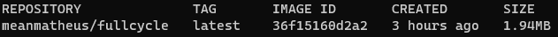

# Desafio docker FullCycle

## Desafio 1
 Dockerfile para executa um script GO, e diminuir o tamanho da imagem para menos de 2MB.
 É possivel baixar ela em `meanmatheus/fullcycle`.

 

## Desafio 2
  Utilizando o docker compose estabelecer um servidor Nginx como proxy reverso em conjunto com o Express e MySQL.